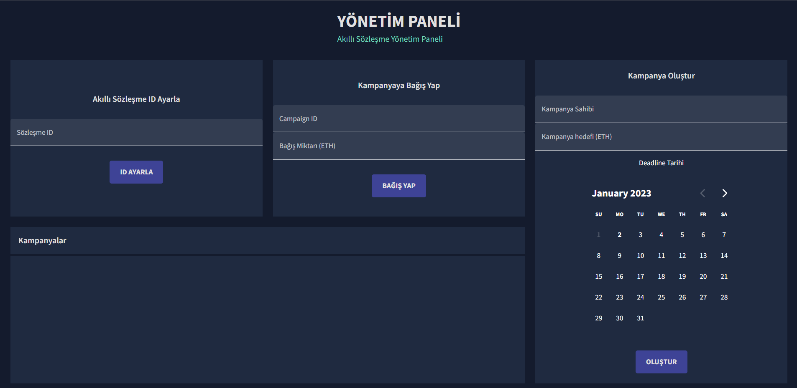
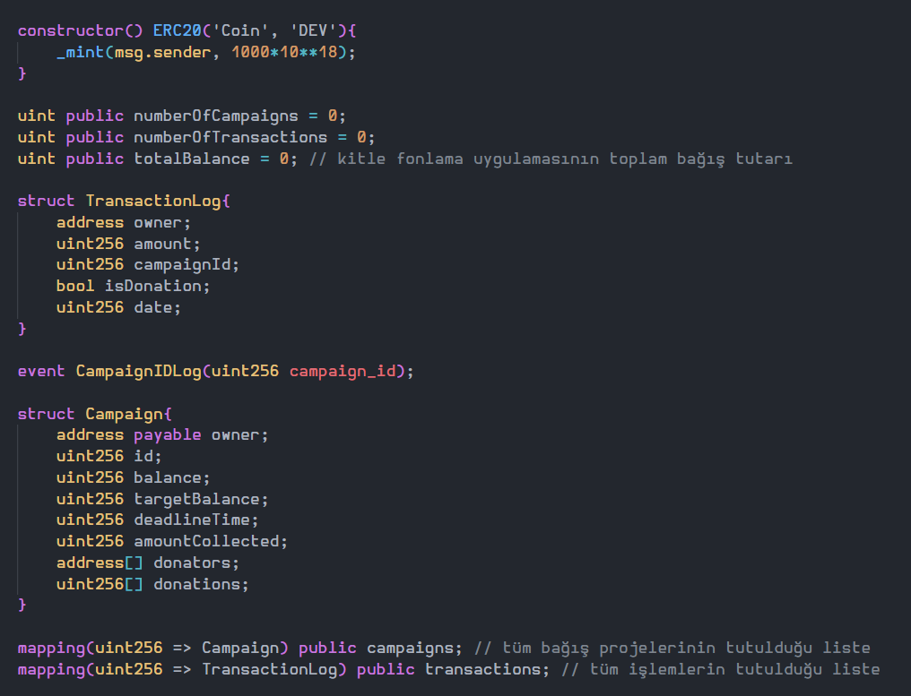
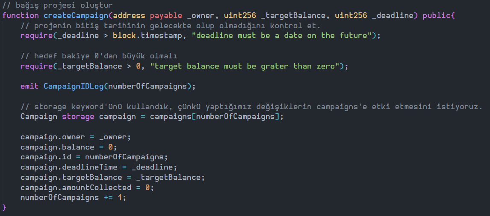
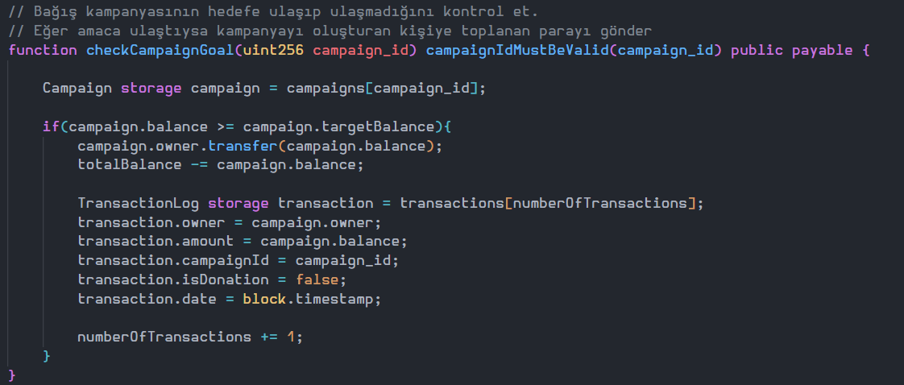
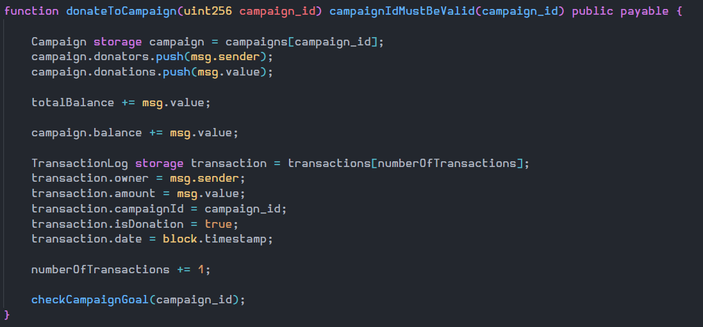
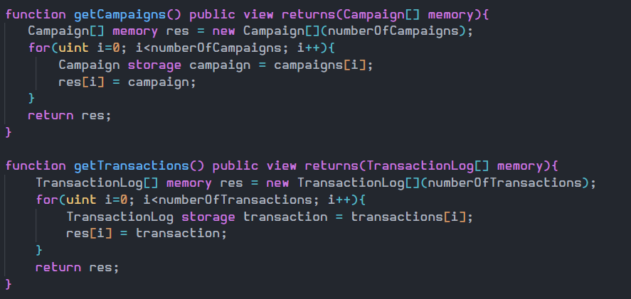

## Description
This is a frontend integration app with your smart contracts you deployed in mainnet or testnet.

## Pre-requisites

1 - This app uses MetaMask to connect to your wallet. You can download it here: https://metamask.io/

2 - Connect to your wallet and make sure you have some ETH to pay for the gas fees. Recommend way to do this 
connect a testnet like Ropsten or Rinkeby and get some ETH from a faucet.

3 - You need to have a smart contract deployed in mainnet or testnet. You can use Remix to deploy your smart contract.

4 - Get your ABI and contract address and replace with abi.json file in src folder of frontend app.

5 - First you need to set your contract address at the end of page in app.

6 - Then you can call your smart contract functions.

## Screenshots

## Code Review

We store transaction logs and campaigns dynamic arrays in smart contract. We manage these arrays with a mapping. We can add and remove items from these arrays. We can also get the length of these arrays. numberOfCampaigns and numberOfTransactions are the length of these arrays.

---

This modifier checks given campaign_id is registered in campaigns array. Check this stituation via numberOfCampaigns variable.

---

createCampaign function creates a new campaign and adds it to campaigns array. We use push function to add new campaign to campaigns array. We also store the campaign in campaigns mapping.
Given deadline must be greater than current time. And targetAmount must be greater than 0. In the beginning campaign balance is 0.

---

This function check campaign reached its target amount or not. If it is reached, smart contract transfers campaign balance to campaign owner. And this transaction is added to transactions array with transaction type Withdraw.

---

donateToCampaign function use campaignIdMustBeValid modifier to check given campaign_id is valid. With this function we can donate to a campaign. We also add this transaction to transactions array with transaction type Donate. We also check campaign reached its target amount or not with checkCampaignGoal function.

---

This functions returns campaigns and transactions arrays. This is useful for frontend app. We can use this function to get all campaigns and transactions and show user in frontend app.

## Sunum Videosu

https://www.loom.com/share/15ba3bdfe5f64c618f1c0cfba5dc8977 
